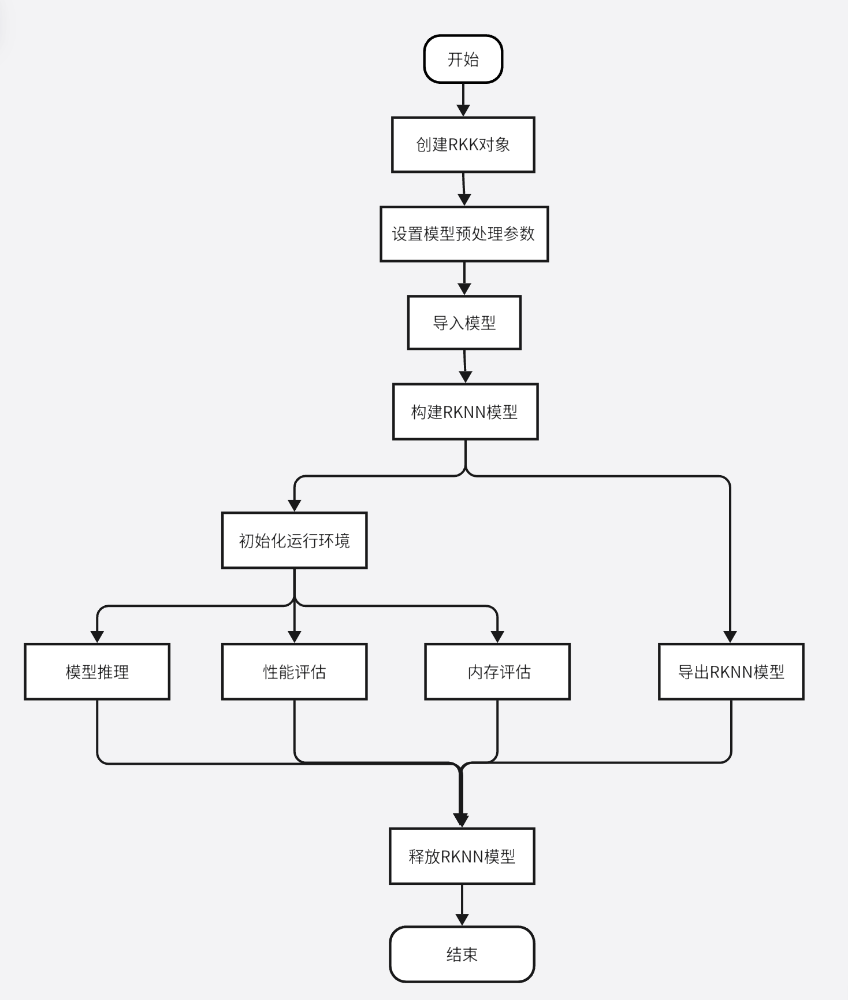

# RKNN

## 1. 文件准备

仓库地址：https://github.com/rockchip-linux/rknn-toolkit2?tab=readme-ov-file

整体框架：


**框架解读：**要使用RKNPU进行模型推理，首先需要运行RKNN-Toolkit2工具，将训练好的模型转换为RKNN格式模型，然后使用RKNN C API 或Python API在开发板上进行推理

**仓库工具：**

* ***RKNN-Toolkit2***：软件开发套件，可在PC和瑞芯微NPU平台上运行，进行模型转换、量化、推理、性能和内存评估、量化精度分析、模型加密等功能
* ***RKNN-Toolkit-Lite2***：提供NPU平台python编程接口，用于板端部署RKNN模型

* ***RKNN Runtime***：为RKNPU平台提供跨平台C/C++编程接口，能够帮助用户部署使用RKNN模型

## 2. RKNN Toolkit2接口

### 2.1 Toolkit2简介

该工具在PC平台使用，提供python接口简化模型的部署和运行。具备一下功能：

* **模型转换**：支持导入原始的Caffe、Tensorflow、TensorFlowLite、ONNX、Pytorch、Darknet格式模型转化为RKNN模型，同时支持在NPU平台上加载推理
* **量化功能**：支持浮点模型量化为定点模型，目前支持的量化方法为非对称量化
* **模型推理**：能够在PC上模拟NPU运行RKNN模型并获取推理结果；或将RKNN模型分发到指定的NPU设备上进行推理并获取推理结果
* **性能和内存评估**：连接板卡，将RKNN模型分发到指定NPU设备上运行，然后评估模型在实际设备上的运行时的性能和内存占用情况
* **量化精度分析**：该功能将给出模型量化后每一层推理结果与浮点模型推理结果的余弦距离，已分析量化误差是如何出现的，为提高量化模型的精度提供思路
* **模型加密**：使用指定的加密等级RKNN模型整体加密，因为RKNN模型的解密是在NPU驱动中完成，所以使用加密模型时，与普通RKNN模型一样加载即可，NPU驱动会自动对齐进行解密

使用ToolKit-lite2，可以运行在PC上，可以通过模拟器运行模型，然后进行推理，或模型转换等操作；也可以运行在连接的板卡NPU上，将RKNN模型传到NPU设备上运行，再从NPU设备上获取推理结果、性能信息等。



流程简述：

* 创建RKNN对象，初始化RKNN环境
* 设置模型预处理参数，如果是运行在PC上，通过模拟器运行模型时需要调用config接口设置模型的预处理参数；如果运行在连接的板卡NPU上并且导入RKNN模型，不需要配置
* 导入模型，如果是运行在PC上，通过模拟器运行模型时使用load_onnx等接口导入对应的非RKNN模型；运行在板卡NPU使用接口load_rknn导入RKNN模型
* 构建RKNN模型，在PC上运行，通过模拟器运行模型，需要调用build接口构建RKNN模型，然后可以导出RKNN模型或初始化运行环境进行推理等操作；如果运行在板卡NPU上则不需要
* 初始化运行时环境，如果需要模型推理或性能评估，必须先调用init_runtime初始化运行时环境，要指定模型的运行平台（模拟器或连接板卡的硬件NPU）
* 初始化运行环境后，可以调用inference接口进行推理，使用eval_perf接口对模型性能进行评估，或者使用eval_memory接口获取模型在硬件平台上运行时的内存使用情况（模型必须运行在硬件平台上）
* 最后调用release接口释放RKNN对象

使用load_rknn导入rknn模型时，不能调用accuracy_analysis精度分析，需要导入非rknn模型，然后构建模型时设置量化

### 2.2 Toolkit使用 

#### 2.2.1 RKNN初始化参数及释放

在使用Toolkit2的所有API接口时，都需要先调用RKNN()方法初始化RKNN对象，不再使用该对象时通过调用该对象的release()方法进行释放

```python
rknn=RKNN(verbose,verbose_file)

# verbose：为true时，打印详细日志在屏幕上
# verbose_file：当verbose=true，且verbose_file指定文件路径时，日志信息还将写到该参数指定的文件中
```

#### 2.2.2 模型配置

构建RKNN模型之前，需要对模型进行通道均值、量化图像RGB2BGR转换、量化类型等配置，这些操作可以通过config接口进行配置

```python
rknn.config(mean_values,
            std_values,
            quant_img_RGB2BGR,
            quantized_dtype,
            quantized_algorithm,
            quantied_method,
            float_dtype,
            optimization_level,
            target_platform,
            custom_string,
            remove_weight,
            compress_weight,
            single_core_mode,
            model_pruning,
            op_target,
            dynamic_input,
            quantize_weight,
            remove_reshape
           )
# mean_values:输入的均值。参数格式为列表，列表中包含一个或多个均值子列表，多输入模型对应多个子列表，每个子列表的长度与该输入的通道数一致。默认值为None,表示所有mean为0
# std_values:输入的归一化值。参数格式为列表，列表中包含一个或多个归一化值自列表，多输入模型对应多个子列表，每个子列表的长度与输入通道数一致。默认值为None，表示所以std为1
# quant_img_RGB2BGR:表示在加载量化图像时是否需要先做RGB2BGR操作。多输入操作可以使用[true,false,true]。默认值为false,不对.npy格式输入生效。该配置仅用于在量化阶段（build）接口读取量化图像或量化精度分析（accuracy_analysis接口），并不会保存在RKNN模型中，因此如果模型输入是BGR，调用Toolkit2的inference或C-API的run函数之前，也需要保证传入模型的图像数据为BGR格式
# quantized_dtype:量化类型，目前支持asymmetric_quantized-8。默认值是asymmetric_quantized-8
# quantized_algorithm：计算每一层的量化参数时采用的量化算法，目前支持的量化算法有：normal，mmse 及 kl_divergence。默认值为 normal。normal 量化算法的特点是速度较快，推荐量化数据量一般为 20-100 张左右，更多的数据量下精度未必会有进一步提升；mmse量化算法由于采用暴力迭代的方式，速度较慢，但通常会比normal具有更高的精度，推荐量化数据量一般为20-50张左右，用户也可以根据量化时间长短对量化数据量进行适当增减；kl_divergence量化算法所用时间会比 normal 多一些，但比mmse会少很多，在某些场景下（feature分布不均匀时）可以得到较好的改善效果，推荐量化数据量一般为20-100张左右
# quantized_method：目前支持layer和channel。默认值为channel。layer：每层的weight值友一套量化参数；channel：每层的weight的每个通道都有一套量化参数，通常channel会比layer精度更高
# float_dtype:用于指定非量化情况下的浮点的数据类型，目前支持的数据类型有float16.默认值为float16
# op_target:用于指定OP的具体执行目标（NPU/CPU/GPU等），格式为{'op0_output_name':'cpu', 'op1_output_name':'npu', ...}。默认值为 None。其中，'op0_output_name'和'op1_output_name'为对应OP的输出tensor名，可以通过精度分析（accuracy_analysis）功能的返回的结果中获取。'cpu'和'npu'则表示该tensor对应的OP的执行目标是CPU或NPU，目前可选的选项有：'cpu'/'npu'/'gpu'/'auto'，其中'auto'是自动选择执行目标
# dynamic_input:用于用户指定的多组输入shape，来模拟动态输入的功能。默认为None。实验性功能。注意：1.需要原始模型支持多态输入；2.只有原始模型动态的轴可以设置不同的值
# quantize_weight:在build接口do_quantization为False情况下，通过对一起的权重进行量化以减小rknn模型的大小，默认值为false
# remove_reshape: 删除模型的输入和输出中可能存在的 Reshape 的 OP，以提高模型运行时性能（因为目前很多平台的Reshape是跑在cpu上，相对较慢）。默认为false
# 没有返回值
```

#### 2.2.3 模型加载

```python
# 加载Caffe模型
rknn.load_caffe(model,							# caffe模型文件(.prototxt)路径
          blobs,							# caffe模型二进制数据文件(.caffemodel)路径
          input_name					# caffe 模型存在多输入时，可以通过该参数指定输入层名的顺序，形如['input1','input2','input3']，注意名字需要与模型输入名一致；默认值为 None，表示按caffe 模型文件（.prototxt 后缀文件）自动给定
          )
# 返回值：0导入成功；-1导入失败
```

```python
# 加载tensorflow模型
rknn.load_tensorflow(tf_pb,				  	# TensorFLow模型文件(.pb)路径
               	inputs,						# 模型输入节点（tensor名）所有输入节点名放在一个列表中
               	input_size_list,	# 输入节点对应的shape，所有的属兔shape放在一个列表中
               	outputs,					# 模型输出节点，支持多个输出节点。所有输出节点名放在一个列表中
                input_is_nchw			# 模型输入layout是否是NCHW。默认值为false，表示默认输入layout为NHWC
               )
# 返回值:0导入成功；-1导入失败
```

```python
# 加载tflite模型
rknn.load_tflite(model,									# TensorFlow Lite模型文件(.tflite)路径
           input_is_nchw,						# 模型输入layout是否是NCHW。默认值为false，表示默认输入layout为NHWC
           )
# 返回值:0导入成功；-1导入失败
```

```python
# 加载load_onnx模型
rknn.load_onnx(model,						# ONNX模型文件(.onnx)路径
         inputs,						#	输入节点名，支持多输入节点，所有输入节点名放在一个列表中。默认值为None，从模型中获取
         input_size_list, 	# 每个输入节点对应的shape，所有输入shape放在一个列表中。如inputs有设置，则input_size_list也需要被设置。默认值为 None。
         input_initial_val,	# 设置模型输入的初始值，格式为ndarray的列表。默认值为None。主要用于将某些输入固化为常量，对于不需要固化为常量的输入可以设为None，如[None, np.array([1])]
         outputs,						# 模型的输出节点（tensor 名），支持多个输出节点，所有输出节点名放在一个列表中。默认值为None，表示从模型里获取
         )
# 返回值:0导入成功；-1导入失败
```

```python
# 加载pytorch模型,支持量化感知qat模型
rknn.load_pytorch(model,								#	pytorch模型(.pt)路径，且需要时torchscript格式的模型			
            input_size_list)			# 每个输入节点对应的shape,所有输入shape放在一个列表中
# 返回值:0导入成功；-1导入失败
```

#### 2.2.4 构建RKNN模型

```python
rknn.build(do_quantization,							# 是否对模型进行量化。默认值为true
          dataset,											# 用于量化的数据集。目前支持文本文件格式，用户可以把用于矫正的图像文件路径放到.txt文件中。文本文件里每一行一条路径。注意：量化图像需要建议选择与预测场景较吻合的图片)
           rknn_batch_size,							# 模型输入的Batch参数调整。默认为None，表示不进行调整。如果大于1可以同时推理多帧图像。1.rknn_batch_size调整不会提高一般模型在NPU上的执行性能，但是会显著增加内存消耗以及增大单帧延迟。2，rknn_batch_size调整可以降低超小模型在CPU上的消耗，提高超小模型的平均帧率。（CPU开销大于NPU开销）；3.rknn_batch_size 修改后，模型的 input/output 维度会被修改，使用inference推理模型时需要设置相应的input的大小，后处理时，也需要对返回的outputs进行处理。
          )
# 返回值：0构建成功；1构建失败
```

#### 2.2.5 导出RKNN模型

```python
rknn.export(export_path,							# 导出模型文件的路径
           	cpp_gen_cfg								# 是否生成C++部署推理示例，默认值为false。1.生成文件：模型路径同文件夹下，生成rknn_deploy_demo文件夹、说明文档；2.支持功能：验证模型推理是CAPI个接口的耗时，验证推理结果的余弦精度，支持常规API接口，支持图像/npy输入
           )
# 返回值：0导出成功；-1导出失败
```

#### 2.2.6 加载rknn模型

```python
# 加载RKNN模型。加载完RKNN模型后，不需要再进行模型配置、模型加载和构建RKNN模型步骤。并且加载后的模型仅限于连接NPU硬件进行推理或获取性能数据。不能用于模拟器或精度分析等
rknn.load_rknn(path,						# RKNN模型文件路径
              )
# 返回值：0加载成功；-1加载失败
```

#### 2.2.7 初始化运行环境

在模型推理或性能评估之前，必须先初始化运行环境，明确模型的运行平台（具体的目标硬件平台或软件模拟器）

```python
rknn.init_runtime(target,					# 目标硬件平台持“rk3566”、“rk3568”、“rk3588”、“rv1103”“rv1106”、“rk3562”。默认值为None。表示在在PC使用，模型在模拟器上运行
                 device_id,				# 设备编号，如果 PC 连接多台设备时，需要指定该参数，设备编号可以通过“list_devices”接口查看。默认值为 None
                 perf_debug,			# 进行性能评估时是否开启 debug 模式。在 debug 模式下，可以获取到每一层的运行时间，否则只能获取模型运行的总时间。默认值为 False
                 eval_mem,				# 是否进入内存评估模式。进入内存评估模式后，可以调用 eval_memory接口获取模型运行时的内存使用情况。默认值为 False
                 async_mode,			# 是否使用异步模式。默认值为False。目前不支持
                 core_mask				# 设置运行时的 NPU 核心。支持的平台为 RK3588，支持的配置如下：RKNN.NPU_CORE_AUTO：表示自动调度模型，自动运行在当前空闲的 NPU 核上。RKNN.NPU_CORE_0：表示运行在 NPU0 核心上。RKNN.NPU_CORE_1：表示运行在 NPU1 核心上。RKNN.NPU_CORE_2：表示运行在 NPU2 核心上。RKNN.NPU_CORE_0_1：表示同时运行在 NPU0、NPU1 核心上。RKNN.NPU_CORE_0_1_2：表示同时运行在 NPU0、NPU1、NPU2 核心上。默认值为 RKNN.NPU_CORE_AUTO
                 )
# 返回值：0初始化运行时环境成功；-1初始化运行时环境失败
```

#### 2.2.8 模型推理

```python
# 对当前模型进行推理，并返回推理结果。如果RKNNToolkit2运行在pc上，且初始化环境时设置target为NPU设备，得到的是模型在硬件平台上的推理结果；如果RKNNToolkit2运行在PC上，且初始化环境时没有设置target，得到的是模型在模拟器上的推理结果
rknn.inference(inputs,								# 待推理的输入列表，格式为ndarray
              data_format,						# 输入数据的layout，‘nchw’或‘nhwc’。默认为None，表示所有输入为nhwc
              inputs_pass_throught		# 输入的透传列表。默认值为None，表示所有输入都不透传。非透传模式下，在将输入传给NPU驱动之前，工具会对输入进行减均值、除方差等操作；而透传模式下，不会做这些操作，而是直接将输入传给 NPU。该参数的值是一个列表，比如要透传 input0，不透传 input1，则该参数的值为[1, 0]。
              )
# 返回值：result：推理结果，类型是ndarray list
```

#### 2.2.9 评估模型性能

模型必须运行在RK3566 / RK3568 / RK3588 / RV1103 / RV1106 /RK3562 设备上。如果调用“**init_runtime**”的接口来初始化运行环境时设置 perf_debug为 False，则获得的是模型在硬件上运行的总时间；如果设置 perf_debug 为 True，除了返回总时间外，还将返回每一层的耗时情况

```python
rknn.eval_perf(is_print)
# is_print:是否打印性能信息，默认值为True
# 返回值：perf_result性能信息
```

#### 2.2.10 获取内存使用情况

获取模型在硬件平台运行时的内存使用情况。模型必须运行在板卡上

```python
rknn.eval_memory(is_print)
# is_print:是否打印内存信息，默认值为True
# 返回值：内存使用情况，类型为字典。包含'weight_memory' 字段表示运行时模型权重的内存占用。'internal_memory' 字段表示运行时模型中间tensor内存占用。'other_memory'字段表示运行时其他的内存占用。'total_model_allocation' 表示运行时的总内存占用，即权重、中间 tensor 和其他的内存占用之和。
```

#### 2.2.11 查询SDK版本

获取 SDK API 和驱动的版本号

```python
rknn.get_sdk_version()
# 返回值API和驱动版本信息，类型为字符串
```

#### 2.2.12 混合量化

使用混合量化功能时，第一阶段调用的主要接口是 hybrid_quantization_step1，用于生成临时模型 文件（ {model_name}.model ）、 数 据 文 件（ {model_name}.data ）和量化配置文件（{model_name}.quantization.cfg）

```python
# 根据加载的原始模型，生成对应的临时模型文件、配置文件和量化配置文件
rknn.hybrid_quantization_step1(dataset,
                              rknn_batch_size,
                              proposal,					# 产生混合量化的配置建议值，默认为false
                               proposal_data_size,	#proppsal使用的dataset张数，默认为1.因为proposal功能比较耗时
                               custom_hybrid		# 用于根据用户指定的多组输入和输出名，选取混合量化对应子图。格式为[[input0_name, output0_name], [input1_name, output1_name], …]。默认值为None。输入和输出名应根据生成的临时模型文件({model_name}.model)来选择
                              )
# 返回值：0成功；-1失败
```

```python
# 接收临时模型文件、配置文件、量化配置文件和校正数据集作为输入，生成混合量化后的 RKNN 模型
rknn.hybrid_quantization_step2(model_input,	# hybrid_quantization_step1 生成的临时模型文件（{model_name}.model）路径
                              data_input,		#hybrid_quantization_step1 生成的数据文件（{model_name}.data）路径
                              model_quantization_cfg		# hybrid_quantization_step1 生成并经过修改后的模型量化配置文件（{model_name}.quantization.cfg）路径
                              )
# 返回值：0成功；1失败
```

#### 2.2.13 量化精度分析

该接口的功能是进行浮点、量化推理并产生每层的数据，并进行量化精度分析。

* 该接口只能在build或 hybrid_quantization_step2之后调用;

* 如未指定target，且原始模型应该为已量化的模型（QAT模型）,则会调用失败;

* 该接口使用的量化方式与config中指定的一致

```python
rknn.accuracy_analysis(inputs,
                      out_dir,
                      target,					# 目标硬件平台
                      device_id				# 设备编号，多个设备时使用，默认值为None
                      )
# 返回值：0成功；-1失败
```

#### 2.2.14 获取设备列表

列出已连接的 RK3566 / RK3568 / RK3588 / RV1103 / RV1106 / RK3562

目前设备连接模式有两种：ADB 和 NTB。多设备连接时请确保他们的模式都是一样的

```python
rknn.list_devices()
# 返回值：返回adb_devices列表和ntb_devices列表，如果设备为空，则返回空列表
```

注意：使用多设备时，需要保证它们的连接模式都是一致的，否则会引起冲突，导致设备连接失败

#### 2.2.14 导出加密模型

```python
export_encrypted_rknn_model(input_model,				# 待加密RKNN模型路径
                           output_model,				# 加密后保存路径，默认值为None，表示{original_model_name}.crypt.rknn作为加密后的模型名字
                           crypt_level					# 加密等级，1，2，3，默认值为1.等级越高安全性越高，解密越耗时
                           )
```

#### 2.2.15 注册自定义算子

```python
# 注册用户提供的自定义算子类。只支持ONNX模型
rknn.reg_custom_op(custom_op)
# 返回值：0成功；1失败
```

* 非ONNX标准的算子：当用户需要自定义一个不存在于ONNX算子规范内的新算子时，可以使用非ONNX标准的算子。该算子的 op_type 需以“cst”字符开头，并且其算子类的shape_infer和 compute函数也需要用户自己实现

* 替换ONNX算子：当用户仅需要替换 ONNX 的 runtime 实现时，可以使用替换ONNX 算子。该算子只要满足 ONNX 规范即可，并且不用实现算子类的shape_infer和compute函数

注：custom_op算子类仅用于模型转换并生成带有自定义算子的RKNN模型，在设备端进行部署时还需要参考《RKNN 用户指南》的5.5章节
